Non-parametric spectral estimates
=================================

SRILAKSHMI ALLA

Regular periodogram

Blackman-Tukey method with hamming window

Minimum Variance method for different length local FIR filters

Welch method with and without segment overlaps

Multi-taper method with DPSS windows.

Contents
--------

-   [Clearing memory](#1)
-   [Goal of the project](#2)
-   [Generation of Colored Noise](#3)
-   [Periodogram](#4)
-   [Repeating periodogram for 50 realizations](#5)
-   [Blackman-Tukey method with hamming window](#6)
-   [Minimum Variance metthod](#7)
-   [Minimum Variance method](#8)
-   [Welch method with no segment overlaps and the hamming window](#9)
-   [Welch method with 50% overlap between segments](#10)
-   [Multi-taper method with DPSS windows](#11)
-   [Comparison of the results obtained from above methods](#12)
-   [Note:](#13)
-   [Reference](#14)

Clearing memory {#1}
---------------

``` {.codeinput}
clc;
clear all;
close all;
```

Goal of the project {#2}
-------------------

Goal of the project is to find the spectral estimates of a colored noise
using different Non-parametric spectral estimates

Generation of Colored Noise {#3}
---------------------------

``` {.codeinput}
Fs=10000; % Sampling Frequency(Hz)
Ts=1/Fs;  % Sampling time
N=500;    % Number of samples
t=0:Ts:(N-1)*Ts; % The time vector

x=randn(size(t)); % White Gaussian noise with unit variance

% filter

num=1;
den=[1 -1.585 0.96];

% Output of the filter

y=filter(num,den,x); % Coloured noise


figure(1);
plot(t,y);
xlabel('time');
ylabel('Amplitude');
title('Coloured noise');
```

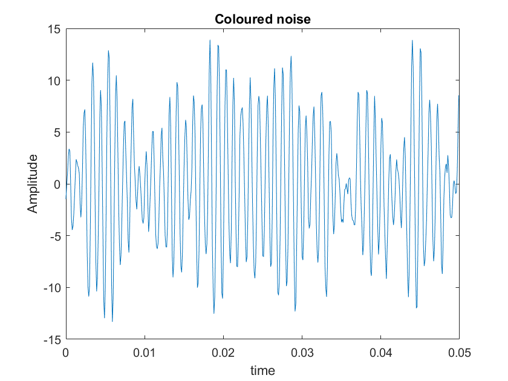

Periodogram {#4}
-----------

``` {.codeinput}
% Frequency Response of the filter

[h,w]=freqz(num,den,4096);

% Regular periodogram

[pxx,W]=periodogram(y,[],2^12);

% [] gives us a rectangular window whereas 2^12=4096 are number of points

figure(2);
subplot(2,1,1);
plot(W/(2*pi),10*log10(pxx'));
hold on;
plot(w/(2*pi),20*log10(abs(h)),'r');
hold off;
grid on;
xlabel('Frequency(Hz)');
ylabel('Power(db)');
title('Periodogram PSD Estimate:1 realization');

% On re-iterating the periodogram keeps changing and its getting adjusted
% into ideal spectrum.
```

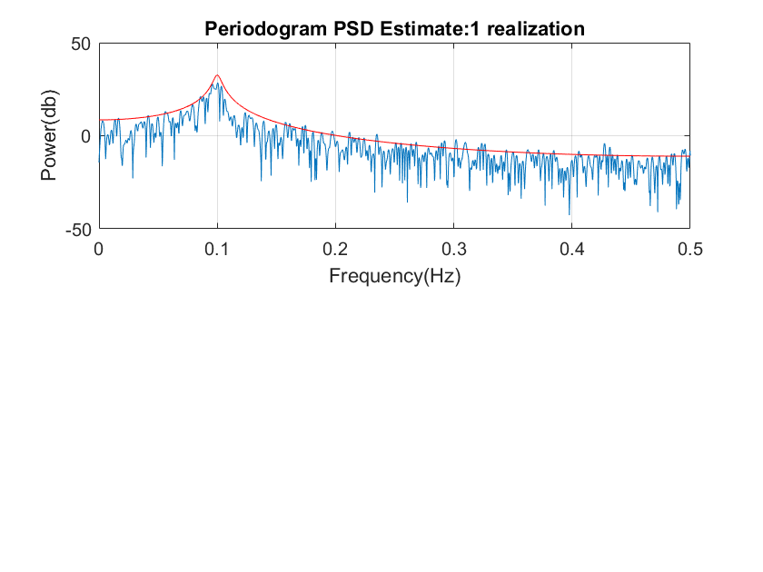

Repeating periodogram for 50 realizations {#5}
-----------------------------------------

This question is asking us to store each value of periodogram obtained
from each realization and then average it(i.e..,ensemble average) and
plot it over ideal spectrum.

What is a periodogram and what happens on averaging?

Any time series can be expressed as a combination of cosine (or sine)
waves with differing periods (how long it takes to complete a full
cycle) and amplitudes (maximum/minimum value during the cycle). This
fact can be utilized to examine the periodic (cyclical) behavior in a
time series.

A periodogram is used to identify the dominant periods (or frequencies)
of a time series. This can be a helpful tool for identifying the
dominant cyclical behavior in a series, particularly when the cycles are
not related to the commonly encountered monthly or quarterly
seasonality.(Source:Internet)

``` {.codeinput}
for m=1:50

    xr(m,:)=randn(size(t));
    yr(m,:)=filter(num,den,xr(m,:)); % Coloured noise
    [Pxx(m,:),Wr]=periodogram(yr(m,:),[],2^12);

end

Pxx_ag=mean(Pxx);


figure(2);
subplot(2,1,2);
plot(Wr/(2*pi),10*log10(Pxx_ag'));
hold on;
plot(w/(2*pi),20*log10(abs(h)),'r');
hold off;
grid on;
xlabel('Frequency(Hz)');
ylabel('Power(db)');
title('Periodogram PSD Estimate:50 realizations');


% Bias and Variance of the spectrum of the ensemble average comparing with
% the spectral estimate of one realization

% The periodogram is asymptotically unbiased, which is evident from the
% earlier observation as length increases,it approximates to the Dirac delta function.
%
% The variance can be reduced on averaging

% Overlay of periodograms

figure(3);
plot(Wr/(2*pi),10*log10(Pxx'));
grid on;
xlabel('Frequency(Hz)');
ylabel('Power(db)');
title('Overlay of 50 realiazations:Periodogram');
```

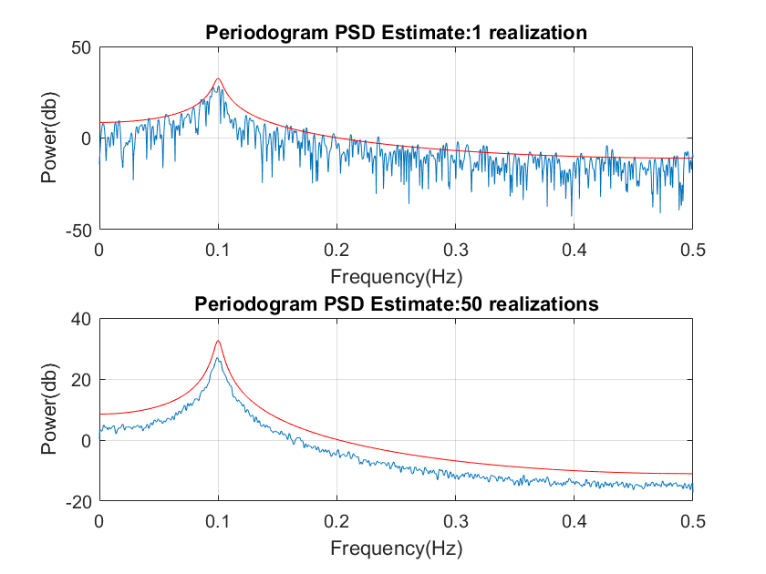
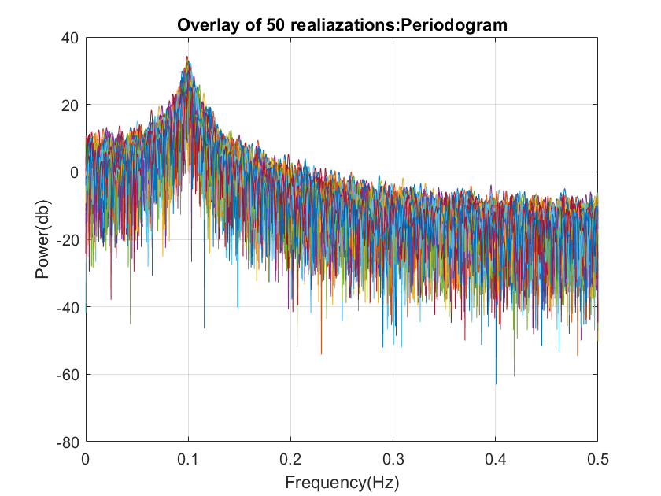

Blackman-Tukey method with hamming window {#6}
-----------------------------------------

Length of hamming window is equal to the length of the signal

``` {.codeinput}
[pxx_bt,W]=per_smooth(y,hamming(N-1),N/2);% persmooth gives results for Blackman-Tukey method


figure(4);
subplot(2,1,1);
plot(W/(2*pi),10*log10(pxx_bt'));
hold on;
plot(w/(2*pi),20*log10(abs(h)),'r');
hold off;
grid on;
xlabel('Frequency(Hz)');
ylabel('Power(db)');
title('Blackman-Tukey PSD Estimate:1 realization');


for m=1:50

    xr(m,:)=randn(size(t));
    yr(m,:)=filter(num,den,xr(m,:)); % Coloured noise
    [Pxx_bt(m,:),Wr]=per_smooth(yr(m,:),hamming(N-1),N/2);

end

Pxx_ag_bt=mean(Pxx_bt);


figure(4);
subplot(2,1,2);
plot(Wr/(2*pi),10*log10(Pxx_ag_bt'));
hold on;
plot(w/(2*pi),20*log10(abs(h)),'r');
hold off;
grid on;
xlabel('Frequency(Hz)');
ylabel('Power(db)');
title('Blackman-Tukey PSD Estimate:50 realizations');


% Overlay of periodograms

figure(5);
plot(Wr/(2*pi),10*log10(Pxx_bt'));
grid on;
xlabel('Frequency(Hz)');
ylabel('Power(db)');
title('Overlay of spectrum:50 realizations');

% From the plots,we can observe that Blackman-Tukey gives better estimate
% on averaging.Spectrum of ensemble average has less bias and variance than
% spectral estimate of one realization
```

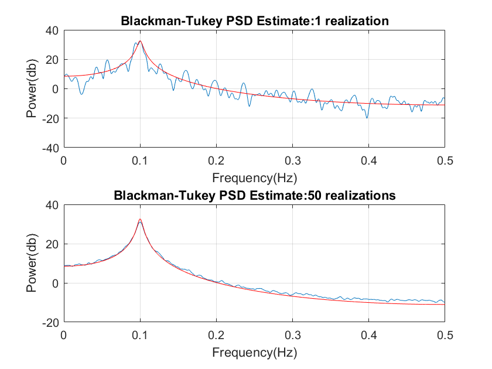
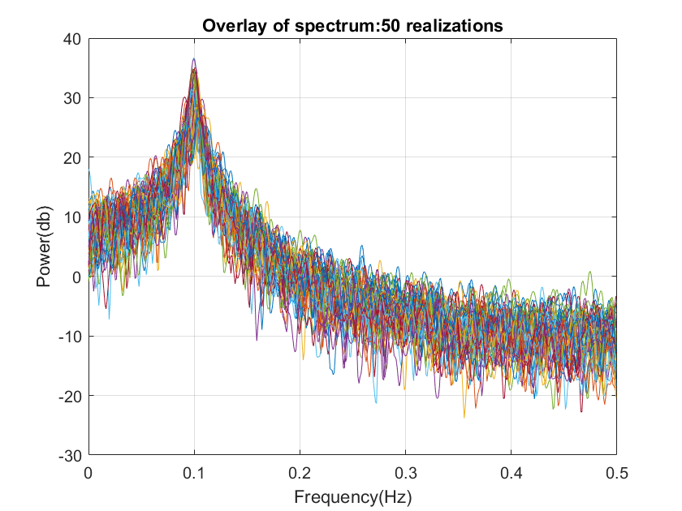

Minimum Variance metthod {#7}
------------------------

``` {.codeinput}
l=200; % length of filter
p=l-1; % order of filter
Nf=2^12;
f=0:1/Nf:(Nf-1)/Nf*1/2;

pxx_mv=MV(y,p,f);


figure(6);
subplot(2,1,1);
plot(f,10*log10(pxx_mv'));
hold on;
plot(w/(2*pi),20*log10(abs(h)),'r');
hold off;
grid on;
xlabel('Frequency(Hz)');
ylabel('Power(db)');
title('Minimum Variance PSD Estimate(200 taps):1 realization');


for m=1:50

    xr(m,:)=randn(size(t));
    yr(m,:)=filter(num,den,xr(m,:)); % Coloured noise
    Pxx_mv(m,:)=MV(yr(m,:),p,f);

end

Pxx_ag_mv=mean(Pxx_mv);


figure(6);
subplot(2,1,2);
plot(f,10*log10(Pxx_ag_mv'));
hold on;
plot(w/(2*pi),20*log10(abs(h)),'r');
hold off;
grid on;
xlabel('Frequency(Hz)');
ylabel('Power(db)');
title('Minimum Variance PSD Estimate(200 taps):50 realizations');

% Overlay of periodograms

figure(7);
plot(f,10*log10(Pxx_mv'));
grid on;
xlabel('Frequency(Hz)');
ylabel('Power(db)');
title('Overlay of Spectrum:Minimum Variance(50)');

% Minimum Variance is one of the best method to find spectral estimate.It
% has better estimate on averaging when compared to single realization.
% Bias and Variance is reduced on averaging.
```

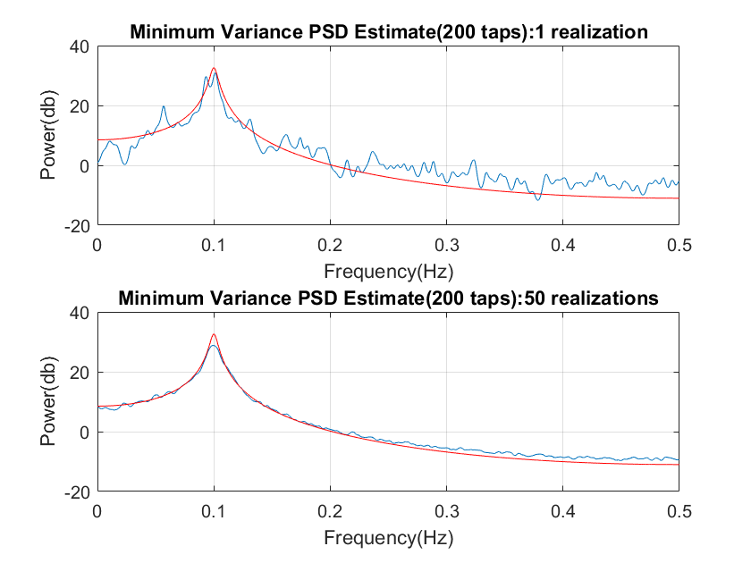
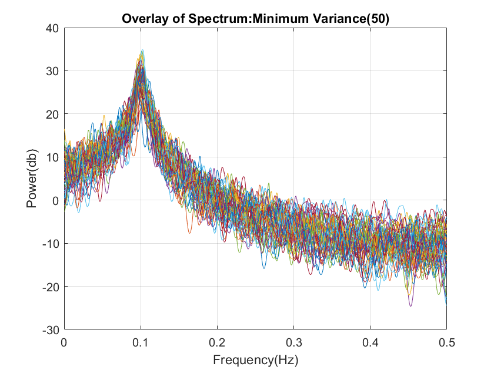

Minimum Variance method {#8}
-----------------------

``` {.codeinput}
l=500; % length of filter
p=l-1; % order of filter
Nf=2^12;
f=0:1/Nf:(Nf-1)/Nf*1/2;

pxx_mv=MV(y,p,f);


figure(8);
subplot(2,1,1);
plot(f,10*log10(pxx_mv'));
hold on;
plot(w/(2*pi),20*log10(abs(h)),'r');
hold off;
grid on;
xlabel('Frequency(Hz)');
ylabel('Power(db)');
title('Minimum Variance PSD Estimate(500 taps):1 realization');


for m=1:50

    xr(m,:)=randn(size(t));
    yr(m,:)=filter(num,den,xr(m,:)); % Coloured noise
    Pxx_mv(m,:)=MV(yr(m,:),p,f);

end

Pxx_ag_mv=mean(Pxx_mv);


figure(8);
subplot(2,1,2);
plot(f,10*log10(Pxx_ag_mv'));
hold on;
plot(w/(2*pi),20*log10(abs(h)),'r');
hold off;
grid on;
xlabel('Frequency(Hz)');
ylabel('Power(db)');
title('Minimum Variance PSD Estimate(500 taps):50 realization');

% Overlay of periodograms

figure(9);
plot(f,10*log10(Pxx_mv'));
grid on;
xlabel('Frequency(Hz)');
ylabel('Power(db)');
title('Overlay of Spectrum(Minimum Variance:500 taps):50 realizations');


% On increasing number of taps,we get a spectral estimate more closer to
% ideal spectrum than with spectrum with 200 taps
% Spectrum of ensemble average has very less bias and variance compared to
% single realization.
%
```

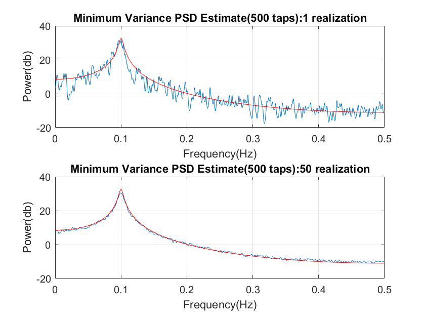
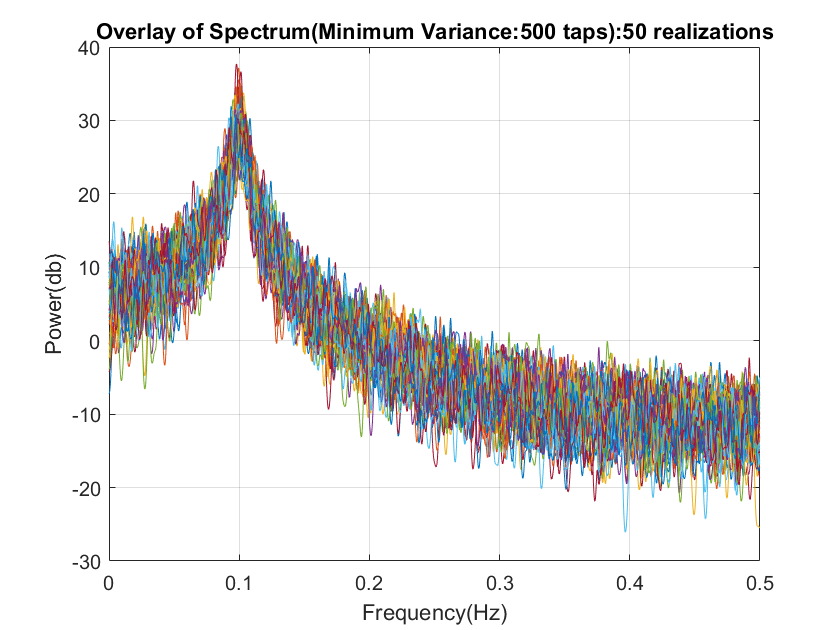

Welch method with no segment overlaps and the hamming window {#9}
------------------------------------------------------------

``` {.codeinput}
K=10; % Lets consider 10 segments
L=N/K;

[pxx_welch,ww]=pwelch(y,hamming(2*L-1),0,2^12);


figure(10);
subplot(2,1,1);
plot(ww/(2*pi),10*log10(pxx_welch'));
hold on;
plot(w/(2*pi),20*log10(abs(h)),'r');
hold off;
grid on;
xlabel('Frequency(Hz)');
ylabel('Power(db)');
title('Welch PSD Estimate:1 realization');


for m=1:50

    xr(m,:)=randn(size(t));
    yr(m,:)=filter(num,den,xr(m,:)); % Coloured noise
    Pxx_welch(m,:)=pwelch(yr(m,:),hamming(2*L-1),0,2^12);

end

Pxx_ag_welch=mean(Pxx_welch);


figure(10);
subplot(2,1,2);
plot(ww/(2*pi),10*log10(Pxx_ag_welch'));
hold on;
plot(w/(2*pi),20*log10(abs(h)),'r');
hold off;
grid on;
xlabel('Frequency(Hz)');
ylabel('Power(db)');
title('Welch PSD Estimate:50 realizations');

% Overlay of periodograms

figure(11);
plot(ww/(2*pi),10*log10(Pxx_welch'));
grid on;
xlabel('Frequency(Hz)');
ylabel('Power(db)');
title('Overlay of Spectrum(Welch):50 realizations');
```

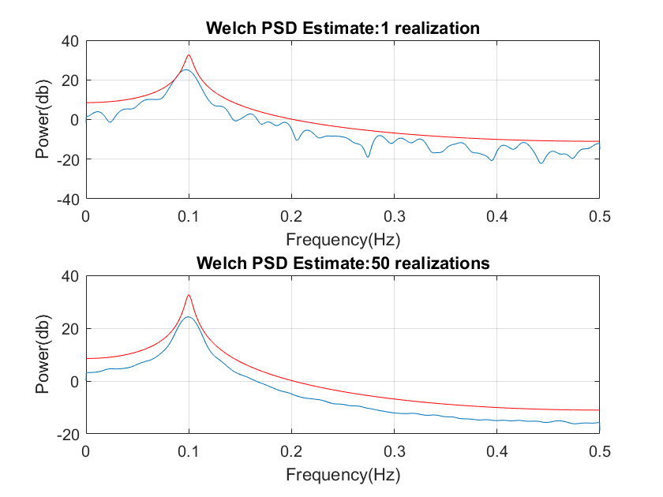
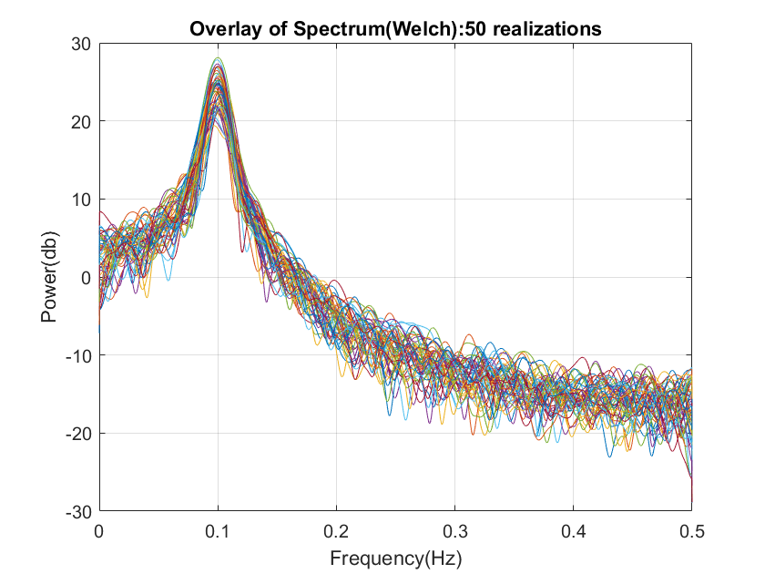

Welch method with 50% overlap between segments {#10}
----------------------------------------------

``` {.codeinput}
K=10; % Lets consider 10 segments
L=N/K;

[pxx_welch,ww]=pwelch(y,hamming(2*L-1),L/2,2^12);


figure(12);
subplot(2,1,1);
plot(ww/(2*pi),10*log10(pxx_welch'));
hold on;
plot(w/(2*pi),20*log10(abs(h)),'r');
hold off;
grid on;
xlabel('Frequency(Hz)');
ylabel('Power(db)');
title('Welch PSD Estimate(50% overlap):1 realization');


for m=1:50

    xr(m,:)=randn(size(t));
    yr(m,:)=filter(num,den,xr(m,:)); % Coloured noise
    Pxx_welch(m,:)=pwelch(yr(m,:),hamming(2*L-1),L/2,2^12);

end

Pxx_ag_welch=mean(Pxx_welch);


figure(12);
subplot(2,1,2);
plot(ww/(2*pi),10*log10(Pxx_ag_welch'));
hold on;
plot(w/(2*pi),20*log10(abs(h)),'r');
hold off;
grid on;
xlabel('Frequency(Hz)');
ylabel('Power(db)');
title('Welch PSD Estimate(50% overlap):50 realization');

% Overlay of periodograms

figure(13);
plot(ww/(2*pi),10*log10(Pxx_welch'));
grid on;
xlabel('Frequency(Hz)');
ylabel('Power(db)');
title('Overlay of Spectrum(Welch:50% overlap):1 realization');
```


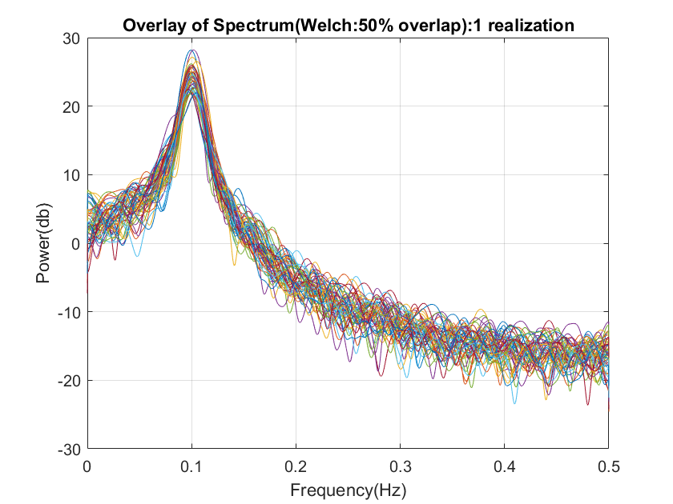

Multi-taper method with DPSS windows {#11}
------------------------------------

``` {.codeinput}
[pxx_mt,wmt]=pmtm(y,[],2^12);

figure(14);
subplot(2,1,1);
plot(wmt/(2*pi),10*log10(pxx_mt'));
hold on;
plot(w/(2*pi),20*log10(abs(h)),'r');
hold off;
grid on;
xlabel('Frequency(Hz)');
ylabel('Power(db)');
title('Multi-taper PSD Estimate:1 realization');


for m=1:50

    xr(m,:)=randn(size(t));
    yr(m,:)=filter(num,den,xr(m,:)); % Coloured noise
    Pxx_mt(m,:)=pmtm(yr(m,:),[],2^12);

end

Pxx_ag_mt=mean(Pxx_mt);


figure(14);
subplot(2,1,2);
plot(ww/(2*pi),10*log10(Pxx_ag_mt'));
hold on;
plot(w/(2*pi),20*log10(abs(h)),'r');
hold off;
grid on;
xlabel('Frequency(Hz)');
ylabel('Power(db)');
title('Multi-taper PSD Estimate:50 realization');

% Overlay of periodograms

figure;
plot(ww/(2*pi),10*log10(Pxx_mt'));
grid on;
xlabel('Frequency(Hz)');
ylabel('Power(db)');
title('Overlay of Spetrum(Multi-taper):50 realizations');

% Multitaper mehod has less bias and variance on averaging when compared to
% spectral estimate with single realization.
%
% On increasing the realizations and averaging bring the spectrum of
% ensemble average closer to ideal spectrum.
```

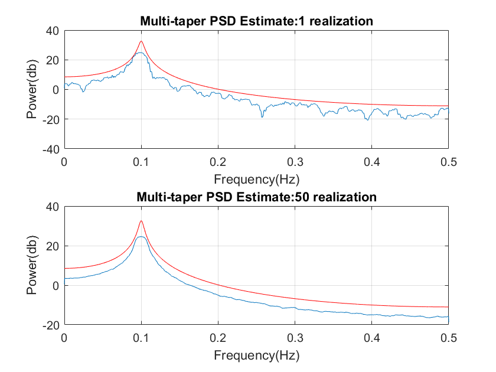
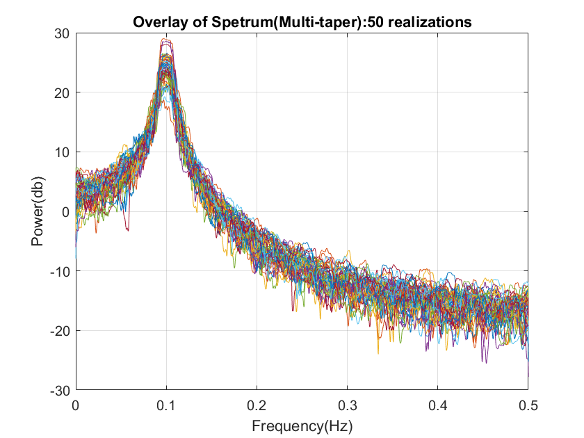

Comparison of the results obtained from above methods {#12}
-----------------------------------------------------

Depending on variability of the estimate and figure of merit(in turn
resolution) we can compare these methods.

Theoretically,Blackman-Tukey method seems to be better than Welch
method.

Out of all the methods, Minimum Variance gives best estimate.This method
is adaptive and uses eigenvalue decomposition making calculations
easier.

Regular Periodogram seems to be having more Variance and non-accurate
estimate of all.

Note: {#13}
-----

I have performed these methods for 50 realizations and 1000 realizations
just to observe what happens when more number of realizations are taken.
It is actually increasing my code run-time.

Reference {#14}
---------

[http://www.mathworks.com/help/signal/ug/nonparametric-methods.html](http://www.mathworks.com/help/signal/ug/nonparametric-methods.html)

\
[Published with MATLAB®
R2017a](http://www.mathworks.com/products/matlab/)\

